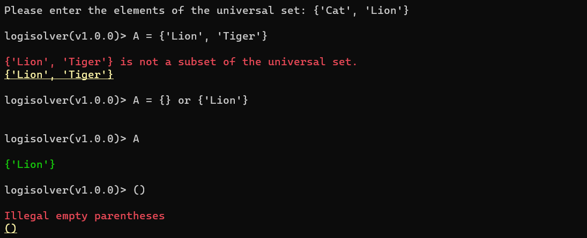

# Logisolver

## Table Of Contents:

* [Overview](#overview)
* [Features](#features)
* [Supported Commands](#supported-commands)
* [Screenshots & Sample Runs](#screenshots--sample-runs)
* [Compatibility](#compatibility)
* [Main Algorithms](#main-algorithms)
* [Data Structures](#data-structures)
* [Regular Expressions](#regular-expressions)
* [Known Issues & Limitations](#known-issues--limitations)
* [Credits](#credits)
* [License](#license)

## Overview

*Logisolver* is a CLI-based tool offering a simple way to do logical operations on sets. Its source code is purely written in Python without using a single third-party library. We believe that this repository is a good starting point for anyone who wants to learn how to build a simple logical expression evaluator. 

## Features

* A fully functional logical expressions solver written in Python 3.
* Well-written tokenizer for free logical expressions typing.
* 25 different slots for defining sets + A dedicated slot for the universal set.
* SQL-like case insensitive queries.
* Fast and robust expression evaluation.
* True expression error tracing.
* Ability to list all defined sets.

## Supported Commands

* **DELETE *SET_POINTER*: ** destroys a set defined previously.
* **LIST:** lists all current defined sets along with their elements and elements count.
* **CLEAR:** clears the console window by removing commands history.
* **EXIT:** exits the whole program and return to the system shell.

## Screenshots & Sample Runs




## Compatibility

*Logisolver* is supposed to work on all platforms supported by Python 3.  However, It was tested only on the following operating systems:

* Microsoft Windows 11 Build 22000.282


## Main Algorithms

### Expression Compiling


### Union (AND)

```pseudocode
GET 2 SETS: A, B
DECLARE ARRAY result
FOR EVERY ELEMENT x IN SET A AND NOT FOUND IN result:
	PUSH IT TO result
FOR EVERY ELEMENT x IN SET B AND NOT FOUND IN result:
	PUSH IT TO result
RETURN result
```

### Intersection (OR)

```pseudocode
GET 2 SETS: A, B
DECLARE ARRAY result
FOR EVERY ELEMENT x IN SET A AND FOUND IN B:
	PUSH IT TO result
RETURN result
```

### Negation (NOT)

```pseudocode
GET SET A AND THE UNIVERSAL SET S
DECLARE ARRAY result
FOR EVERY ELEMENT x IN SET S AND NOT FOUND IN A:
	PUSH IT TO result
RETURN result
```

## Data Structures

### avail_sets (dict[str, list[str]])

The dictionary of all sets defined during the lifecycle of the program. It's initially defined inside the main function and gets passed to the other functions later. Its keys represent the sets pointers, while its values represent the sets themselves. Here is an example of how data are stored during the runtime:

```python
{
	"S": [ "Cat", "Lion", "Dog" ],
	"A": [ "Cat", "Dog" ]
}
```

### constants.supported_operators (dict[str, dict])

The dictionary of all supported operators. Each operator its own priority, callable function and type (either a unary operator or a binary operator). This is a copy of this dictionary.

```python
{
    "NOT": {
        "priority": 0,
        "type": ExpLabels.UNARY_OPERATOR,
        "operations": negation
    },
    "AND": {
        "priority": 1,
        "type": ExpLabels.BINARY_OPERATOR,
        "operations": intersection
    },
    "OR": {
        "priority": 2,
        "type": ExpLabels.BINARY_OPERATOR,
        "operations": union
    }
}
```

### constants.ExpLabels (class)

A non initializable class used only as a source of all supported labels without worrying about typos while referncing those labels. Supported labels are:

* **SET**
* **SET_POINTER**
* **SUB_EXP**
* **UNARY_OPERATOR**
* **BINARY_OPERATOR**
* **SPACE**
* **UNKNOWN**

## Regular Expressions

### Set Intent Detection

```regex
{((\s*(('(\\'|[^'])*?')(\s*,\s*)?)*('(\\'|[^'])*?')\s*)|\s*)}
```

### Set Entities Extraction

```regex
'((?:\\'|[^'])*?)'
```

### Assignment Intent Detection

```regex
(\w)\s*=\s*(.*)
```

### Assignment Entities Extraction

```regex
(\w)\s*=\s*(.*)
```

### Set Elements Extraction

```regex
'((?:\\'|[^'])*?)'
```

### Finalizing Tokenization

```regex
((?:{(?:(?:\s*(?:(?:'(?:\\'|[^'])*?')(?:\s*,\s*)?)*(?:'(?:\\'|[^'])*?')\s*)|\s*)})|(?:\s+))
```

## Known Issues & Limitations

* Set elements can't contain opening and closing parentheses.
* Set elements can be only constrained by single quotes.

## Credits

*Logisolver* is maintained and developed by Ahmed Hassan (@GeeekyBoy).
All thanks to Python Team for providing *re* package that helped a lot while writing the logical expression tokenizer used by *Logisolver*.

## License

*Logisolver* is released under the **GNU AGPLv3** license.